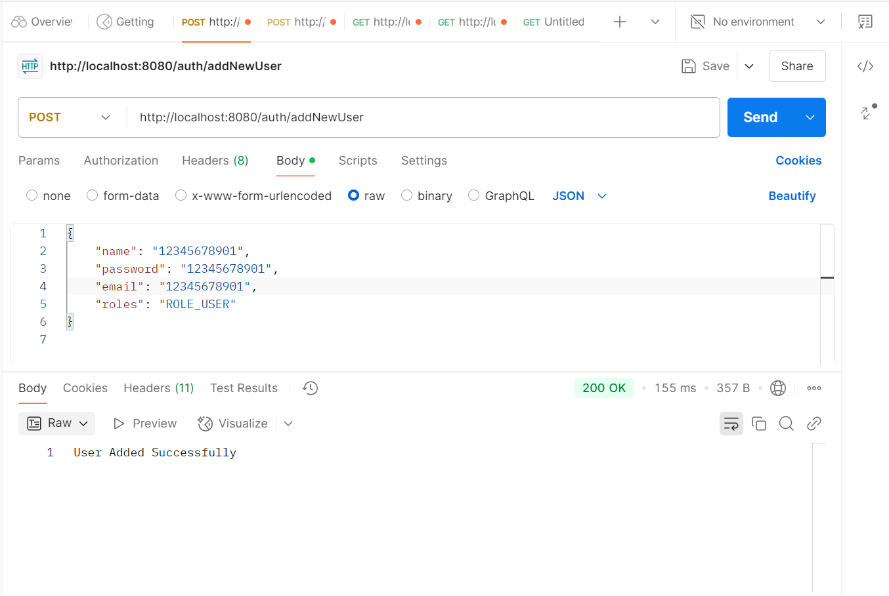
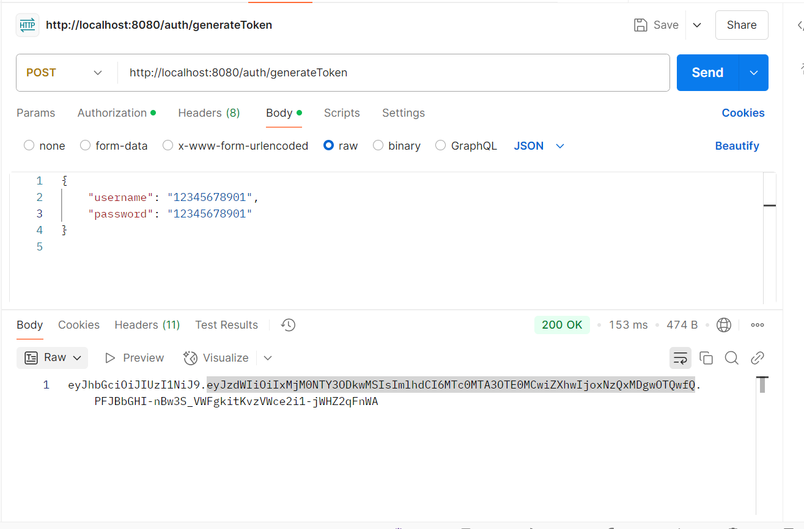
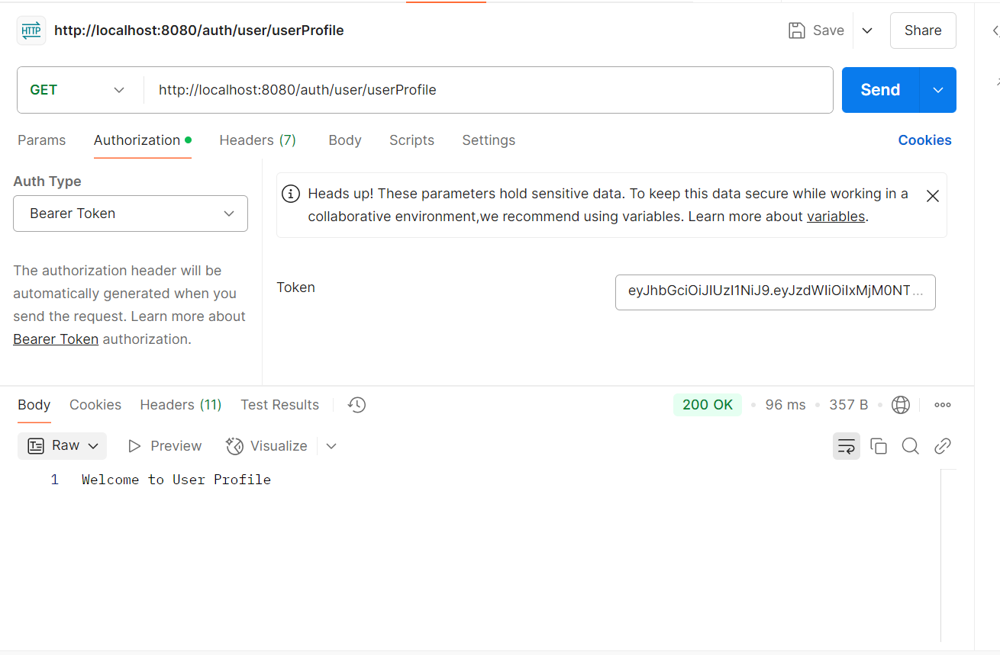
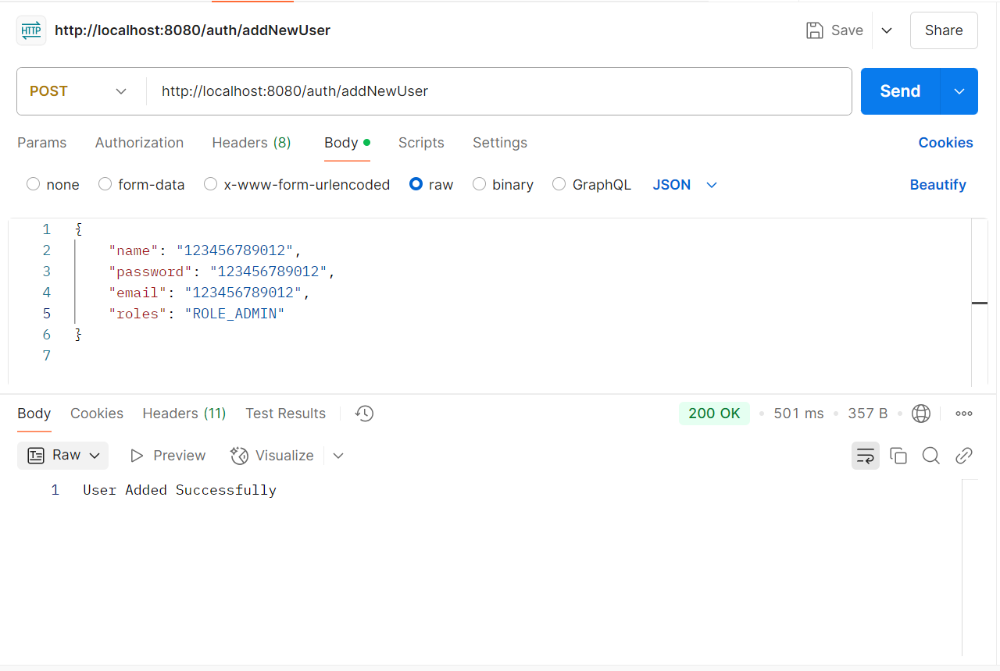
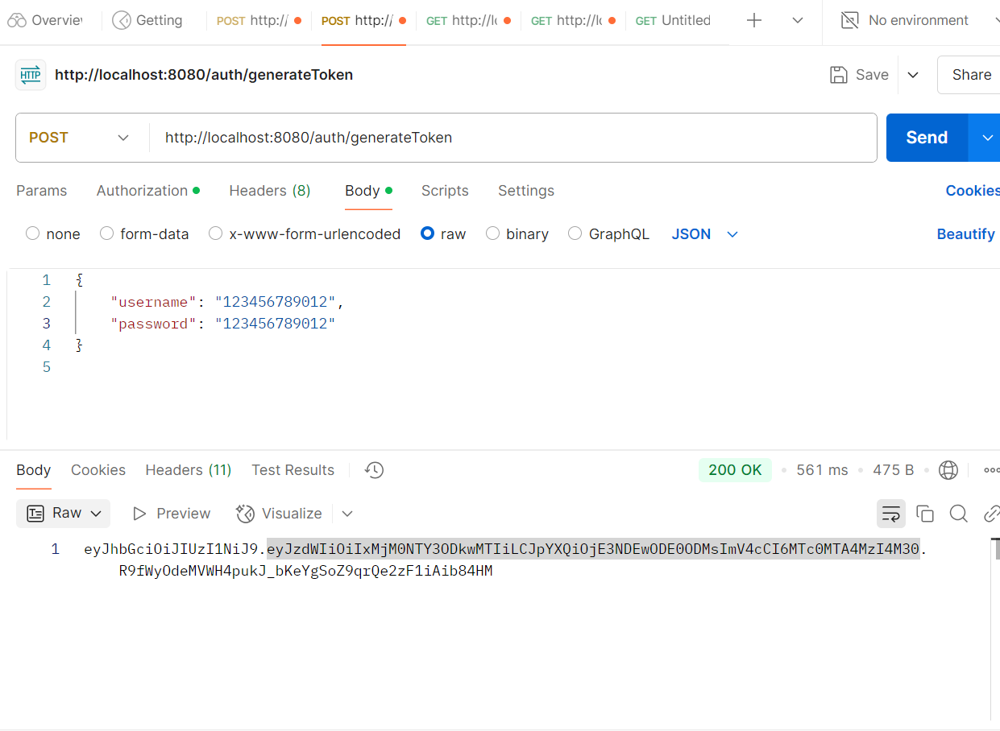
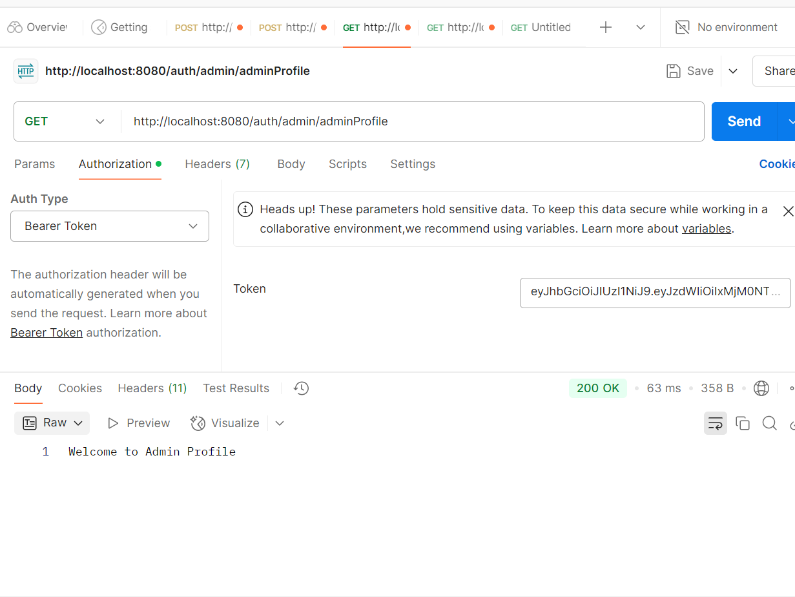
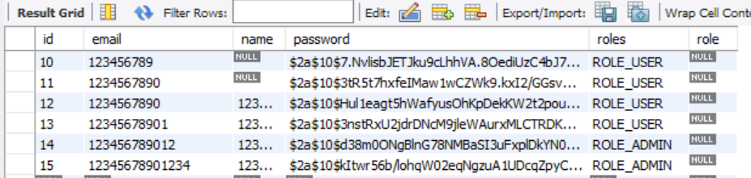

# Spring Boot 3 Security Demo

This project is a demo application showcasing the integration of Spring Boot 3 with Spring Security, JWT authentication, and MySQL database.

## Features

- User and Admin roles with different access levels
- JWT-based authentication and authorization
- Secure REST API endpoints
- User registration and login
- Password encryption using BCrypt
- Integration with MySQL database

## Technologies Used

- Spring Boot 3
- Spring Security
- JSON Web Token (JWT)
- MySQL
- JPA/Hibernate
- Lombok
- Maven

# Demo

## User
### Create new user with POST /auth/user

### Generate user's token POST /auth/token/

### Get users' profile through token with GET /auth/user/profile

## Admin
### Create new admin with POST /auth/user

### Generate admin's token POST /auth/token/

### Get admin's profile through token with GET /auth/admin/profile

## Database

